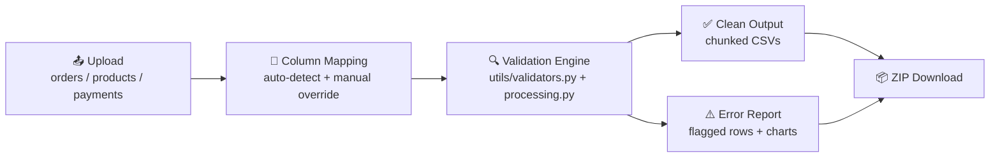

<div align="center">

# 🧾 Transaction Validator

### Configurable, country-aware validation for transaction data — built for speed, not ceremony.

[](https://www.python.org/)
[](https://streamlit.io/)
[](https://pandas.pydata.org/)
[](#license)

</div>

---

## ⚡ What is this?

Upload messy `orders` / `products` / `payments` files. Get back clean, chunked, validated data — plus a full error report — in one ZIP. No schema gymnastics, no hardcoded rules, no backend to babysit.

Phone number rules are **per-country and config-driven** (edit `config/country_rules.json` or update them live in the sidebar — zero code changes). Dates, amounts, and cross-file referential integrity are checked automatically.

---

## 🗺️ Architecture



The UI (`app.py`) never touches validation logic directly — it calls into `utils/processing.py`, which orchestrates pure functions in `utils/validators.py`. Swap the Streamlit layer for a REST API tomorrow and the validation engine doesn't change.

---

## 🧠 Why this stack

**Streamlit over Flask/FastAPI**
This is a single-user, upload-validate-download tool, not a multi-tenant service. Streamlit gets a working UI — file uploaders, sidebar config, charts — in a fraction of the code a Flask + frontend split would need, and it deploys for free with zero infra. A custom API layer would be solving a problem this project doesn't have.

**Pandas over raw CSV parsing**
Referential integrity checks (does this `order_id` actually exist in Orders?) and type/format validation are naturally vectorized, groupable operations. Reimplementing that with the standard `csv` module means hand-rolling joins and indexing that Pandas already does well, for no real benefit.

**JSON config over hardcoded rules**
Phone number validity is *not* one rule — it's one rule per country. Hardcoding digit-length checks in Python means a code change (and redeploy) every time a new country shows up. A `country_rules.json` file means adding Singapore's 8-digit rule is a config edit, not a pull request.

---

## ⚖️ Trade-offs & design decisions

| Decision | Trade-off |
|---|---|
| **Stateless, pure validator functions** | Every function in `utils/validators.py` takes data in, returns flags out — no hidden state, no Streamlit coupling. Easy to unit test and reuse, at the cost of passing config explicitly everywhere instead of relying on globals. |
| **Readable row-level logic where it matters** | Some validation (e.g. cross-file ID matching) favors explicit, debuggable logic over maximally vectorized one-liners. Slightly slower at huge scale, much easier to reason about and extend. |
| **In-memory, session-based processing** | No database. Configuration and data live in the Streamlit session. Perfect for a single-user tool; would need a persistence layer for concurrent multi-user use. |
| **No authentication** | Out of scope for a tool demoed and run by one person at a time. Would be a hard requirement for a shared deployment. |

---

## ✨ Features

- 📂 **Multi-file upload** — CSV or Excel for orders, products, and payments
- 🧭 **Auto column mapping** — detects phone, date, amount, ID, and quantity columns; override any guess
- ☎️ **Country-specific phone validation** — digit-length rules per country, fully config-driven
- 📅 **Smart date detection** — handles ISO, `dd/mm/yyyy`, `mm/dd/yyyy`, and flags inconsistencies
- 🔢 **Numeric & type checks** — amounts and quantities validated for type and sign
- 🔗 **Referential integrity** — catches orphaned records across files (e.g. a payment with no matching order)
- 🧱 **Chunked output** — clean data auto-split once it exceeds a configurable row count
- 📊 **Visual error reporting** — bar charts and summary metrics for flagged rows
- 📦 **One-click ZIP download** — clean data + error report bundled together
- 🛠️ **Zero-code country rules** — add a new country's validation rule from the sidebar

---

## 🚀 Quickstart

```bash
git clone <your-repo-url>
cd transaction-validator
pip install -r requirements.txt
streamlit run app.py
```

Click **"Use bundled sample data"** in the Upload tab for an instant demo, or upload your own files.

### Running tests

```bash
pip install pytest
python -m pytest tests/ -v
```

---

## 📁 Project structure

```
transaction-validator/
├── app.py                      # Streamlit UI — upload, mapping, results, downloads
├── utils/
│   ├── processing.py            # Orchestration: runs validators, chunking, ZIP building
│   └── validators.py            # Pure validation functions (phone, date, numeric, categorical)
├── config/
│   └── country_rules.json       # Phone validation rules, editable without a code change
├── sample_data/                 # Sample orders/products/payments with injected errors
├── tests/
│   └── test_validators.py       # Unit tests for the validation engine
└── requirements.txt
```

---

## 🚫 What I chose NOT to build (and why)

- **Authentication / multi-tenant access** — this is a single-purpose validation tool used by one person at a time. Adding auth would be solving for a deployment model this project doesn't have yet.
- **Persistent, database-backed rule storage** — country rules are editable live in the session via the sidebar. Wiring up a database to persist them felt like premature infrastructure for what's currently an MVP.
- **A REST API wrapper** — the validation engine is already decoupled from the UI on purpose, so an API layer is a clean addition *later*, not a requirement now. Building it speculatively would add surface area with no current consumer.

---

<div align="center">

Built with Python, Pandas, and a healthy respect for messy real-world CSVs.

</div>